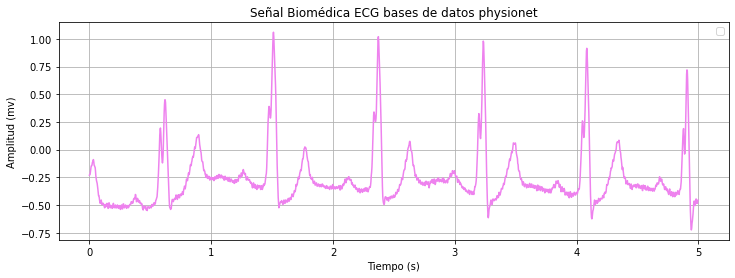
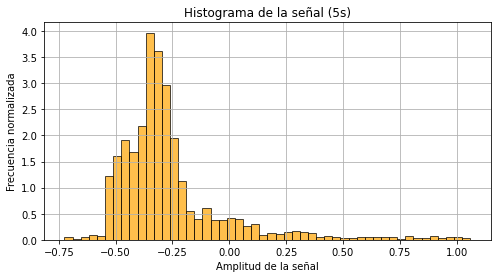
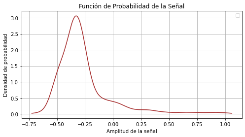
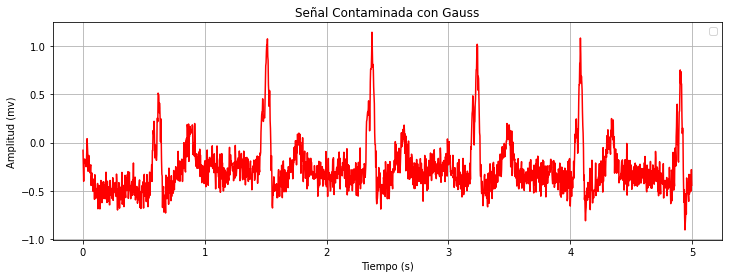
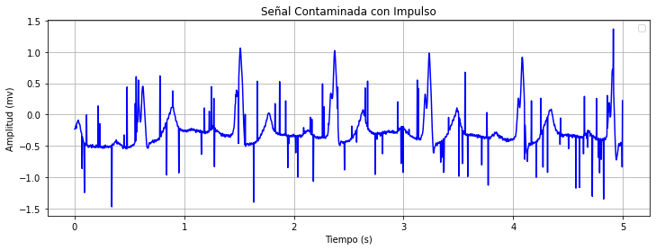
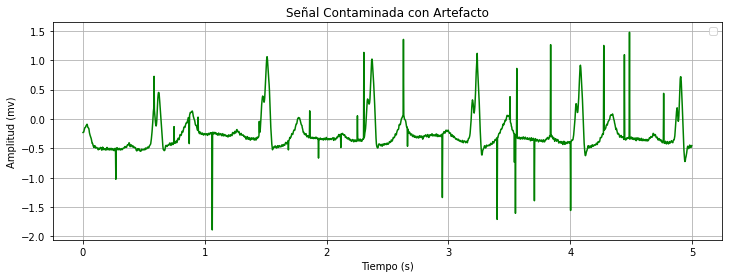
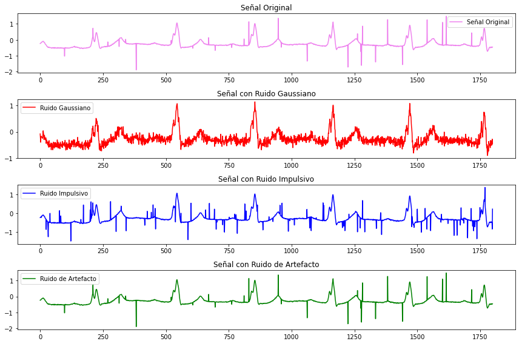

# LABORATORIO 1 PDS

## Analisis estadistico de la señal
 En el presente informe se muestra el código cuyo objetivo es identificar los estadísticos que describen una señal biomédica, obtenerlos a partir de algoritmos de programación y mostrarlos.
### Procesamiento de la señal 
Se eligió la  señal de PhysioNet.El informe que se escogió  es un estudio de la Universidad tecnolólogica  de Brno, este trata de un  ECG en donde tomaron registros  con un enfoque particular por la posición de la onda P creando 3 clasificaciones en diferentes bases de datos dependiendo la patología diagnosticada, encontrando  los cambios de ondas P.

ECG: En la señal se evidencia el registro del potencial de acción durante el ciclo cardiaco. En esta señal se enfatisa en el trazado de la onda P por la señal, esta nos muestra la despolarización de las auriculas en el corazón.

## Codigo

### Liberias
En primer lugar se importaron las librerias wfdb para la funcion record, luego la libreria matplotlib.pyplot para funciones matematicas, la libreria numpy para notacion matematica el scipy.stats para funcion gausiana y por ultimo el random para que la maquina genere o cree numeros random.

    import wfdb
    import matplotlib.pyplot as plt
    import numpy as np
    from scipy.stats import gaussian_kde
    import random

### Valores signal y time

Luego importamos en la misma carpeta donde esta el codigo, los archivos uno .hea y otro .dat ya con eso solo se pondra el nombre que comparten en comun

    ECG = "datos_signal/22"

Ahora bien la señal va a ser la lectura de record de wfdb en el archivo ECG, luego se dejara un solo canal abierto y se hara una frecuencia de muestreo esto sera igual a lo que se demoren todos los datos en la señal, ahora bien el numero de datos sera la funcion len con respecto a signal, el muestreo se va a acortar a 5 segundos de fs, el tiempo sera igual a la frecuencia de muestreo con un for mas un rango del numero de datos y por ultimo vamos a limitar la señal y el tiempo con el muestreo de 5 segundos.

    lecturasignal = wfdb.rdrecord(ECG)
    signal = lecturasignal.p_signal[:,0]  
    fs = lecturasignal.fs  
    numero_datos = len(signal) 
    muestreo=int(5*fs)
    time = [i / fs for i in range(numero_datos)]  
    signal = signal[:muestreo]
    time = time[:muestreo]

### Grafico de la señal 

Ahora bien vamos a graficar esto se hara con la libreria matplotlib.pyplo y lo llamaremos a la libreria plt, primero decidimos que tan grande va a ser la imagen en este caso sera 12X4 luego se pondran parametros en x en este caso tiempo y en y como la señal con un color violeta, se pondra en el eje x el tiempo, en el eje y la amplitud, como tutulo señal biomedica, y por ultimo se cargara la imagen que se mostrara de la siguiente manera:

    plt.figure(figsize=(12,4))
    plt.plot(time, signal, color="violet")
    plt.xlabel("Tiempo (s)")
    plt.ylabel("Amplitud (mv)")
    plt.title("Señal Biomédica ECG bases de datos physionet")
    plt.legend()
    plt.grid()
    plt.show()

Señal biomedica: en la investigación hecha por la universidad tecnologica de Born  extraida  de PhysioNet de un ECG donde tomaron registro de 2 derivaciones en 2 minutos con varios tipos de patologías con ondas P anotadas. Por otra parte cada registro que hicierontambién contiene anotaciones de posiciones y tipos de complejos QRS (de bases de datos originales). La señal exrtraida tiene un tipo de patologia de bloqueo auriculoventricular de primer grado.

### Grafico del histograma

Luego de esto se va a realizar el Histograma de igual manera con librerias, la imagen sera de 8X4, con respecto a los datos de la señal con un bin o recuadro 50 color naranja y contorno negro, en x va a ir como amplitud de la señal, en y ira frecuencia normalizada, el titulo sera histograma de la señal por ultimo se cargara de la siguiente manera:

    plt.figure(figsize=(8, 4))
    plt.hist(signal, bins=50, color='orange', alpha=0.7, edgecolor='black', density=True)
    plt.xlabel("Amplitud de la señal")
    plt.ylabel("Frecuencia normalizada")
    plt.title("Histograma de la señal (5s)")
    plt.grid()
    plt.show()

Histograma: EL histograma es una representación gráfica que muestra la distribución de los valores de voltaje en función del tiempo. Cada barra del histograma representa la frecuencia de los valores de voltaje en función del tiempo.
Lo que se puede evidenciar en este histograma es que es un corazón con ritmo cardiaco normal ya que  la mayor densidad de valores está entre - 0.50mv y -0.25mv. En el cual teoricamente es la fase de despolarización de la celula cardiaca.

## Valores estadisticos 

#### Valores estadisticos sin librerias

Ahora vamos a calcular la media esto sera mediante la suma de todos los datos y la division entre el numero de datos, esto lo haremos con un for con un rango del numero de datos hacia una suma de un vector unitario hacia el numero de dato i correspondiente para con esto la media seria igual a la suma entre la cantidad de datos.

    suma=0
    for i in range(len(signal)):
        suma += signal[i]
    media = suma/ len(signal)
    print(f"Media de la señal: {media:.4f}")

Media de la señal: -0.2642

Ahora en cuanto a la longitud del vector se hara con los datos de la señal y con ello solo se hara como un sumador de la longitud del vector

    longitud_vector = 0
    for _ in signal:
        longitud_vector +=1
    print(f"Longitud del vector: {longitud_vector}")

Longitud del vector: 1800

Para la desviacion debemos recordar que sera igual a la suma de los datos - media y esto elevado al cuadrado con ello se dara la desviacion normal ya este se hara primero un for un rango de la cantidad de datos de la señal luego la desviacion sera la suma anterior del valor mas los datos signal en el momento i menos la media y esto elevado al cuadrado ya por ultimo la desviacion estandar sera la desviacion calculada entre la cantidad de datos

    desviacion = 0
    for i in range(len(signal)):
        desviacion += (signal[i] - media) ** 2
    desviacion_estandar = (desviacion/len(signal)) ** 0.5
    print(f"Desviación estándar: {desviacion_estandar:.4f}")

Desviación estándar: 0.2497

Por ultimo el coeficiente de variancia sera igual a la desviacion estandar entre la media la media debe ser diferente de 0 si esta es igual a 0 no se tomara como valor porque sera indeterminado por ello esta el if

    coeficiente_de_variacion = desviacion_estandar/ media if media != 0 else float ('nan')
    print(f"Coeficiente de variación: {coeficiente_de_variacion:.4f}")

Coeficiente de variación: -0.9453

#### Valores estadisticos con librerias

Ahora tambien podremos calcular la media, la longitud del vector, la desviacion, el coeficiente de variacion con librerias simplemente se llamara a la libreria np para calculos matematicos con una funcion mean para media, len para longitud del vector, std para la desviacion y el coeficiente nan

    media_librerias = np.mean(signal)
    longitud_vector_librerias = len(signal)
    desviacion_librerias = np.std(signal)
    coeficiente_variacion_librerias = desviacion_librerias / media_librerias if media_librerias != 0 else np.nan

    print(f"Media de la señal con librerias: {media_librerias:.4f}")
    print(f"Longitud del vector con librerias: {longitud_vector_librerias}")
    print(f"Desviación estándar con librerias: {desviacion_librerias:.4f}")
    print(f"Coeficiente de variación con librerias: {coeficiente_variacion_librerias:.4f}")

Media de la señal con librerias: -0.2642

Longitud del vector con librerias: 1800

Desviación estándar con librerias: 0.2497

Coeficiente de variación con librerias: -0.9453

De igual forma los valores tanto con librerias como sin librerias son iguales o similares

### Funcion de probabilidad (Campana de gauss)

Ahora bien vamos a calcular la funcion de probabilidad donde llamaremos a la liberia scipy.stats con gauss_kde y se le asignaran los valores de signal, en cuanto a x sera igual a el valor matematico de la libreria np con la funcion linspace esto donde los datos iran de un punto A a un punto B, esto con el minimo signal y el maximo signal, ahora bien se debe evaluar dichos datos como kde en la funcion gaussiana.

    kde = gaussian_kde(signal)
    x_vals = np.linspace(min(signal), max(signal), 1000)
    pdf_vals = kde(x_vals)

Ahora se graficaran los datos donde va a tener la imagen un 8X4 se va a avluar en x los punto a punto linspace, en y se evaluara ya en funcion gaussiana, con un color cafe, en x se llamara amplitud de la señal, en y densisdad de probabilidad, y como titulo funcion de probabilidad y se cargara donde se vera de la siguiente manera:

    plt.figure(figsize=(8, 4))
    plt.plot(x_vals, pdf_vals, color='brown', label="")
    plt.xlabel("Amplitud de la señal")
    plt.ylabel("Densidad de probabilidad")
    plt.title("Función de Probabilidad de la Señal")
    plt.legend()
    plt.grid()
    plt.show()

Función de probabilidad: La función de probabilidad que podemos evidenciar de nuestro histograma es de tipo sesgado hacia la izquierda. Esto quiere decir que la distribución de los valores de voltaje en la señal ECG se inclina más a los valores de voltaje bajos que a los altos. Esto fisiologicamente quiere decir que tenemos actividad electrica en el corazón anormal y puede tratarse de patologías como arritmias o bloqueos cardiacos.

### GENERACION DE RUIDOS
La generación de ruido se puede realizar por medio de diversas librerás y funciones aquí explicaremos algunos ruidos que se le puede agregar a la señal.

### Ruido Gaussiano
En primer lugar el ruido gauss va a ser lo mismo que los datos random osea datos sin snetido alguno generados aleatoriamente de 0 a 0.1 con un rango de datos de la señal esto para poder contaminarla ya luego de esto la señal de gauss sera igual a la señal original mas ruido de la señal ya calculada con un for del rango de la cantidad de datos

        # Ruido Gaussiano
        ruido_gauss = [random.gauss(0, 0.1) for _ in range(len(signal))]
        signal_gauss = [signal[i] + ruido_gauss[i] for i in range(len(signal))]

### Grafica señal contamindad con Gauss

Ahora bien se va a graficar con un tamaño 12X4 con el eje x del tiempo, el eje y la señal de gauss con un color rojo en x ira el tiempo, en y ira la amplitud y en el titulo ira señal contaminada con gauss y se cargara y quedara de la siguiente manera:

        # Grafica señal contaminada Gauss
        plt.figure(figsize=(12,4))
        plt.plot(time, signal_gauss, color="red")
        plt.xlabel("Tiempo (s)")
        plt.ylabel("Amplitud (mv)")
        plt.title("Señal Contaminada con Gauss")
        plt.legend()
        plt.grid()
        plt.show()

### Ruido Impulso
Este se dara mediante datos random pero esta vez con una uniformidad de -1 hasta 1 donde tendra un rango de datos igual a la señal este sera el ruido luego de esto la señal impulso sera igual a la señal mas la señal impulso esto con el mismo rango de datos de la señal original

        # Ruido Impulsivo (Saltos aleatorios grandes)
        ruido_impulso = [random.uniform(-1, 1) if random.random() < 0.05 else 0 for _ in range(len(signal))]
        signal_impulso = [signal[i] + ruido_impulso[i] for i in range(len(signal))]

### Grafica señal contamindad con Impulso
Luego de este se va a graficar con un tamaño 12X4, en x ira el tiempo, en y ira la señal impulso con un color azul, en x ira el tiempo y en y ira la amplitud con un titulo señal contaminda con impulso se cargara y se vera de la siguiente manera:

        # Grafica señal contaminada Impulso
        plt.figure(figsize=(12,4))
        plt.plot(time, signal_impulso, color="blue")
        plt.xlabel("Tiempo (s)")
        plt.ylabel("Amplitud (mv)")
        plt.title("Señal Contaminada con Impulso")
        plt.legend()
        plt.grid()
        plt.show()

### Ruido Artefacto
Ahora en este ruido se hara con un total de picos especificos para el artefacto en este caso nosotros escogimos 30 picos aleatorios, esto con un rango de 30, ahora bien debemos tener en cuenta que idx sera la cantidad de datos random con un complejo en radianes con un inicio 0 hasta la cantidad de datos de la señal original esto a -1 y el ruido del artefacto sera igual a los valores idx contenidos con la suma del anterior con datos random de manera uniforme de -2 hasta 2, con esto la señal del artefacto sera igual al ruido del artefacto.

        # Ruido de artefacto (Picos grandes en zonas específicas)
        ruido_artefacto = signal[:]
        for _ in range(30):  # Introducimos 30 picos aleatorios
            idx = random.randint(0, len(signal) - 1)
            ruido_artefacto[idx] += random.uniform(-2, 2)
        signal_artefacto = ruido_artefacto

### Grafica señal contamindad con Artefacto
Luego de este se va a graficar con un tamaño 12X4, en x ira el tiempo, en y ira la señal artefacto con un color verde, en x ira el tiempo y en y ira la amplitud con un titulo señal contaminda con artefacto se cargara y se vera de la siguiente manera:

        # Grafica señal contaminada artfecto
        plt.figure(figsize=(12,4))
        plt.plot(time, signal_artefacto, color="green")
        plt.xlabel("Tiempo (s)")
        plt.ylabel("Amplitud (mv)")
        plt.title("Señal Contaminada con Artefacto")
        plt.legend()
        plt.grid()
        plt.show()

### Calculos SNR
Ahora bien para este vamos a crear una funcion esto se definira como calcular la potencia esto como senal lo que va a llegar en donde la suma de los cuadrados sera igual a 0 con un for de un rango de la senal, ya con esto la suma de cuadrados sera igual a el dato anterior mas la senal en el momento i elevado al cuadrado y retornando la suma de cuadrados entre la cantidad de datos senal

        # SNR
        def calcular_potencia(senal):
            suma_cuadrados = 0
            for i in range(len(senal)):
                suma_cuadrados += senal[i] ** 2
            return suma_cuadrados / len(senal)

Luego de esto debemos calcular la potencia de la senal esto se dara mediante la funcion calcular potencia y llevamos los datos o valores signal, en cuanto a la potencia de gauss sera igual llevaremos los datos del ruido de gauss a la funcion, y de la misma forma pasa con el impulso, en cuanto al artefacto debemos llevar no solo el ruido artefacto sino debemos llevar la señal artefacto en un momento i menos la señal en el momento i en el rango de datos de la señal

        potencia_senal = calcular_potencia(signal)
        potencia_ruido_gauss = calcular_potencia(ruido_gauss)
        potencia_ruido_impulso = calcular_potencia(ruido_impulso)
        potencia_ruido_artefacto = calcular_potencia([signal_artefacto[i] - signal[i] for i in range(len(signal))])

Ahora bien el SNR sera lo mismo que multiplicar 10 veces el resultado entre la potencia senal entre la potencia de ruido enviada o cargada de igual manera pasara con el impulso y el artfecto

        SNR_gauss = 10 * (potencia_senal / potencia_ruido_gauss)
        SNR_impulso = 10 * (potencia_senal / potencia_ruido_impulso)
        SNR_artefacto = 10 * (potencia_senal / potencia_ruido_artefacto)

Luego vamos a imprimir el valor de cada una de los SNR de cada señal contaminada

        print(f"SNR con ruido Gaussiano: {SNR_gauss:.4f}")
        print(f"SNR con ruido Impulsivo: {SNR_impulso:.4f}")
        print(f"SNR con ruido de Artefacto: {SNR_artefacto:.4f}")

SNR con ruido Gaussiano: 155.1033

SNR con ruido Impulsivo: 98.3997

SNR con ruido de Artefacto: inf

El artfacto dara indefinido debido a que este nunca se suma con signal en el momento i hacia el ruido recordando que son picos y es algo definido dejando casi de lado la aleatoridad de los datos dados por ello puede tener o contener 0 en los picos y con este generar un indefinido

### Grafica comparativa entre la señal original y las contaminadas

Por ultimo vamo a poner todas las graficas en una sola imagen con el fin de compararlas con ello definimos a la imagen de 12X8, en el primer recuadro tendra una sub imagen de 4X1 en la posicion 1 donde ira la señal original en color violeta.

        plt.figure(figsize=(12, 8))
        plt.subplot(4, 1, 1)
        plt.plot(signal, label="Señal Original", color="violet")
        plt.title("Señal Original")
        plt.legend()

Tendremos otro sub cuadro 4X1 pero en la posicion 2 donde ira la señal con ruido gaussiano en color rojo

        plt.subplot(4, 1, 2)
        plt.plot(signal_gauss, label="Ruido Gaussiano", color="red")
        plt.title("Señal con Ruido Gaussiano")
        plt.legend()

Tendremos otro sub cuadro 4X1 pero en la posicion 3 donde ira la señal con ruido impulso en color azul

        plt.subplot(4, 1, 3)
        plt.plot(signal_impulso, label="Ruido Impulsivo", color="blue")
        plt.title("Señal con Ruido Impulsivo")
        plt.legend()

Tendremos otro sub cuadro 4X1 pero en la posicion 4 donde ira la señal con ruido artefacto en color verde y ya se cargara la grafica donde se vera de la siguiente manera:

        plt.subplot(4, 1, 4)
        plt.plot(signal_artefacto, label="Ruido de Artefacto", color="green")
        plt.title("Señal con Ruido de Artefacto")
        plt.legend()

        plt.tight_layout()
        plt.show()

### SRN
SRN no está hablando de la relación entre la señal y el ruido (Signal-to-Noise Ratio). TRata de una medida que se usa principalmente para cuantificar cuánta señal buena o señal de interés está presente en comparación con el nivel de ruido no deseado en nuestra señal extraida. Es decir SNR nos indica la calidad de la señal en relación con la interferencia o distorsión que pueda haber en la señal que estemos recolectando. Matematicamente la relación entre señal-ruido es:

       SRN= 10* log(potencia de la señal/potencia del ruido)

Esta relación se suele medir en desibelios (db).

### Requisitos

- Python 3.11
- Wfdb
- matplotlib
- Numpy
- Random
- scipy.stats

## Bibliografia
- Electrocardiograma de J. L. Rojo-Álvarez, Revista Española de Cardiología (2017).
- Análisis de señales de ECG" A. M. Hernández (2015).
- Histogramas de ECG, una herramienta para la detección de arritmias" de J. M. Martínez, Revista de Cardiología de México (2013).

## Contacto
- **Jose Daniel Porras** est.jose.dporras@unimilitar.edu.co
- **Jhonathan David Guevara Ramirez** est.jhonathan.guev@unimilitar.edu.co 
